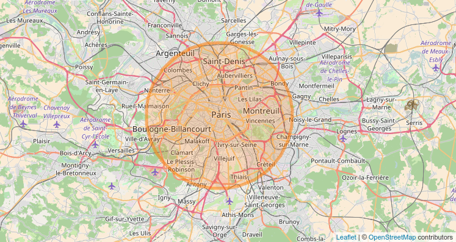

## Equal-Area Buffers for Lon-Lat Coordinates

Creation of an equal area circular buffers for a given lon/lat coordinate.

Written in JavaScript so it can be used with web-mapping tech like Leaflet or OpenLayers



### Functions

First we need to setup functions for converting radians to degrees, and from degrees to radians. JavaScript only works in radians, not degrees.

```js
// convert radians to degrees
function to_deg(radians) {
	return radians * 180 / Math.PI;
};

// convert degrees to radians
function to_radians(degrees) {
    return degrees * Math.PI / 180;
};
```

Since the Earth is not a perfect sphere, we need a function to compute the radius for specific latitude.

```js
function radius_at_lat(latitude) {
    r_a = 6378137.0 // equitorial radius (in m)
    r_b = 6356752.3 // polar radius (in m)
    var radius =  Math.sqrt(
      (r_a * r_a * Math.cos(latitude) * r_a * r_a * Math.cos(latitude) + r_b * r_b * Math.sin(latitude) * r_b * r_b * Math.sin(latitude))
      /
      (r_a * Math.cos(latitude) * r_a * Math.cos(latitude) + r_b * Math.sin(latitude) * r_b * Math.sin(latitude))
    );
    return radius
};
```

The [Haversine formula](https://en.wikipedia.org/wiki/Haversine_formula) computes great circle distances and the associated bearing between two points on the Earth.

Re-working this formula we can find the coordinates of a point given inputs of another point, bearing, and distance.

```js
function destination_point(degrees_lat, degrees_long, distance, angle_circle_deg) {
	var bearing = to_radians(Number(angle_circle_deg)); //
	var dr_ratio = Number(radius / radius_at_lat(degrees_lat)); // ratio of distance to
	var i_lat = to_radians(degrees_lat); // convert input to rad
	var i_lon = to_radians(degrees_long); // convert input to rad
	var d_lat = Math.asin(
		Math.sin(i_lat) * Math.cos(dr_ratio) +
		Math.cos(i_lat) * Math.sin(dr_ratio) * Math.cos(bearing));
	var d_lon = i_lon + Math.atan2(
		Math.sin(bearing) * Math.sin(dr_ratio) * Math.cos(i_lat),
		Math.cos(dr_ratio) - Math.sin(i_lat) * Math.sin(d_lat));
	// convert to long 180 to -180
	d_lon = (d_lon + 3 * Math.PI) % (2 * Math.PI) - Math.PI;
	return [to_deg(d_lon),to_deg(d_lat)];
};
```

Finally, we loop the above calculation for a given distance and set of bearings, and then output the result into a ```geojson`` object for easy display on a web map.

```radius``` is the radius in m for the circle

```edge_points``` is an integer of the number of points that make up the circle. The more points, the more "smooth" the circle.

```circle_centre_point``` is an array of ```[lon,lat]```

```js
function hopeful_circle (circle_centre_point, radius, edge_points) {
  //
  circle_buf_coords = [];
  // first point because geojson needs to close
  circle_buf_coords.push(destination_point(circle_centre_point[1],circle_centre_point[0],radius,0))
  // looping angles in a circle
  inc = 360 / edge_points
  start_d = inc
  for (x = start_d; x <= 360; x += inc) {
    hc = destination_point(circle_centre_point[1],circle_centre_point[0],radius,x);
    circle_buf_coords.push(hc);
  }
  // add to array
  circle_array = [];
  circle_array.push(circle_buf_coords);
  // add to a geojson object
  var circle_geojson = {
    "type": "FeatureCollection",
    "features": [
      {
        "type": "Feature",
        "properties": {},
        "geometry": {
          "type": "Polygon",
          "coordinates": circle_array
        }
      }
    ]
  }
  // export
  return circle_geojson
```
